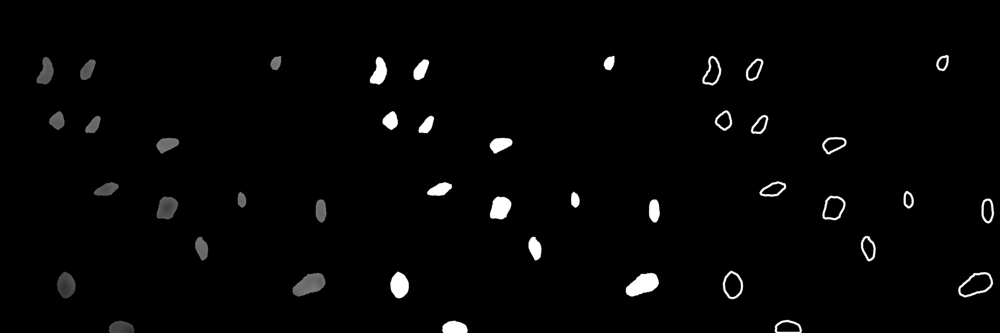
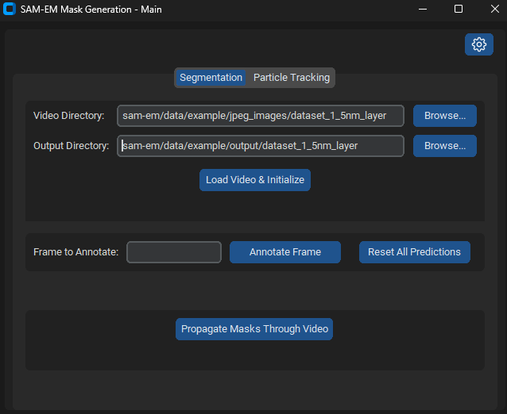
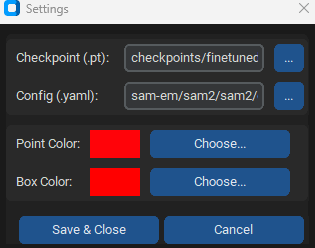
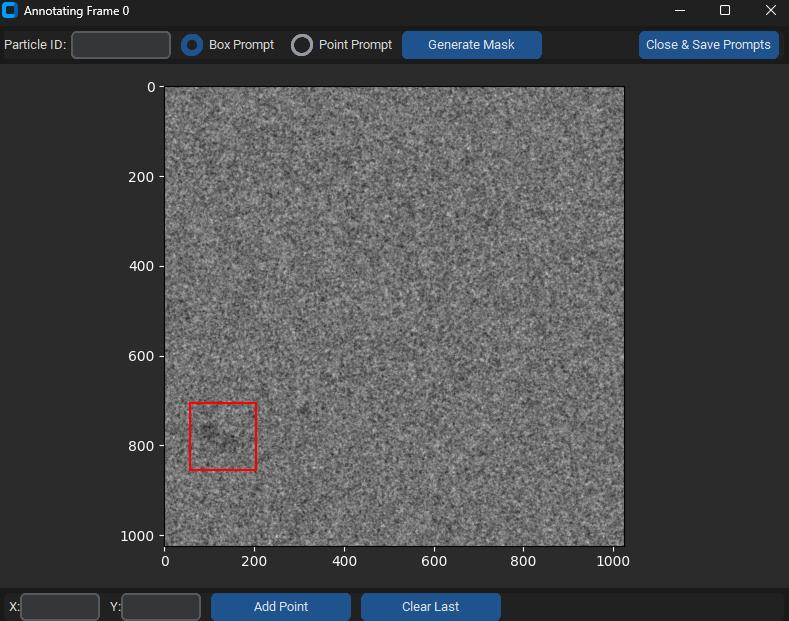
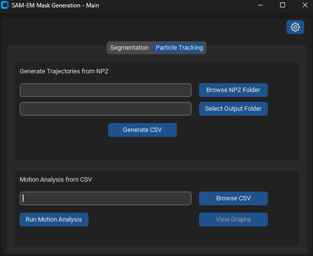
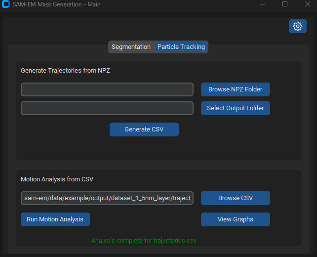
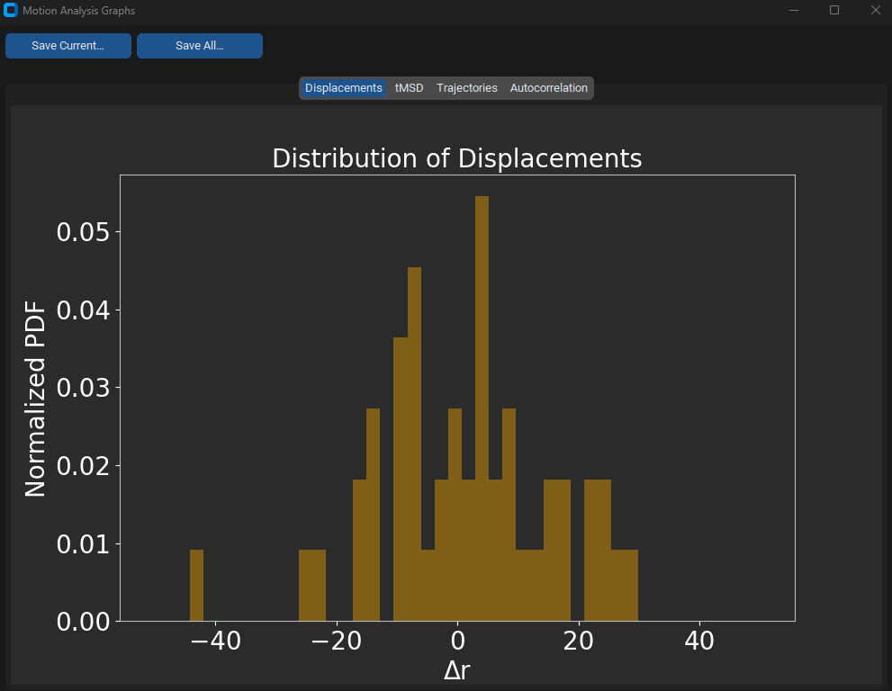

# SAM-EM
## Comprehensive application and framework for multiple particle segmentation and tracking in liquid phase TEM

* * * * * *
## Abstract

The absence of robust segmentation frameworks for noisy liquid phase transmission electron microscopy (LPTEM) videos prevents reliable extraction of particle trajectories, creating a major barrier to quantitative analysis and to connecting observed dynamics with materials characterization and design. To address this challenge, we present Segment Anything Model for Electron Microscopy (SAM-EM), a domain-adapted foundation model that unifies segmentation, tracking, and statistical analysis for LPTEM data. Built on Segment Anything Model 2 (SAM-2), SAM-EM is derived through full-model fine-tuning on 46,600 curated LPTEM synthetic video frames, substantially improving mask quality and temporal identity stability compared to zero-shot SAM-2 and existing baselines. Beyond segmentation, SAM-EM integrates particle tracking with statistical tools, including mean-squared displacement and trajectory distribution analysis, providing an end-to-end framework for extracting and interpreting nanoscale dynamics. Crucially, full fine-tuning allows SAM-EM to remain robust under low signal-to-noise conditions, such as those caused by increased liquid sample thickness in LPTEM experiments. By establishing a reliable analysis pipeline, SAM-EM transforms LPTEM into a quantitative single-particle tracking platform and accelerates its integration into data-driven materials discovery and design.
* * * * * *

## Installation

-First create a conda enviornment for SAM-EM using `conda create -n SAM-EM python=3.10`

-Next install the Meta Segment Anything Model 2 (SAM 2) module inside this envirnment by activating your environment first `conda activate SAM-EM`. For installing SAM 2, follow the installations on the [SAM 2 github repository](https://github.com/facebookresearch/sam2).

-Then place the sam2 folder inside the sam-em root folder.

-Next download our model checkpoint from the following HuggingFace link: https://huggingface.co/sam-em-paper/finetuned-checkpoint/tree/main

-Place the downloaded checkpoint into the folder labeled "checkpoints"

-For the Particle tracking module, install the following packages using the requirements.txt file in SAM-EM git repository:

`pip install -r requirements.txt`

-Finally, run /application/app.py

using `python ./application/app.py` assuming that you are in the sam-em root directory.

This is the main screen.

Click the gear icon in the top right to specify the location of the checkpoint and config file for the finetuned model.

Then back in the main menu, specify the video directory which contains the video frames and the output directory. Press load video and intialize. Then select annotate frame 0, and press annotate frame.

For each particle prompt annotation, enter the particle ID starting from 0 then 1, etc. Then drag a box prompt around the particle. Press generate mask, then move on to select prompts for all other particles. When you are done, select close and save prompts. On the main screen, press propogate masks, with results being stored in the output folder. 

An example video of the drawn masklets can be seen as following:

For the particle tracking portion of the application, click on particle tracking on the top element to get to the main screen of particle tracking.

Then browse the output folder for the output csv, and press run motion analysis.

Finally, press view graphs.

